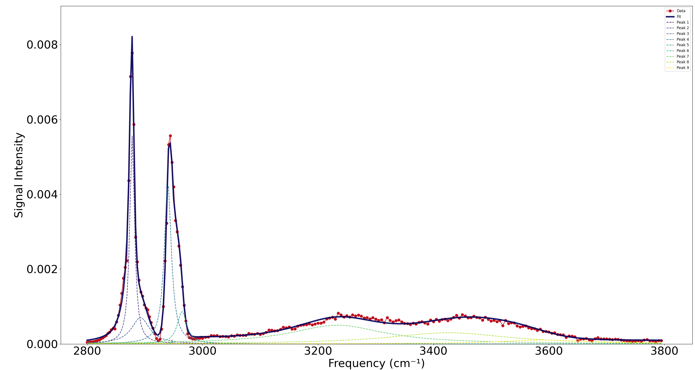

# SFG Spectrum Fitting with Lorentzian-Gaussian Peaks

This Python script fits experimental Sum-Frequency Generation (SFG) spectral data using a model composed of Lorentzian-Gaussian hybrid peaks, along with background terms. It uses non-linear least-squares optimization to extract the parameters that best represent the data.

### 📊 Example Output


---

## 📁 Files

- `fit_sfg.py` — Main script that performs the fit, plots results, and exports data.
- `data.csv` — Input data file containing two tab-separated columns: `x` (frequency) and `y` (intensity).
- `parameters.csv` — Input parameter file with initial values, bounds, and labels.
- `fit_output.csv` — Output file containing original data, predicted fit, and individual peak contributions.

---

## 📊 Model Description

The model consists of:

- A constant offset (green light background)
- A nonresonant background term
- A sum of `N` peaks, each represented by a Lorentzian-Gaussian hybrid function with four parameters:
  - **A**: Amplitude
  - **wr**: Center frequency
  - **Tau**: Linewidth
  - **Sigma**: Gaussian broadening

When `Sigma <= 10`, the peak is treated as purely Lorentzian for computational efficiency.

---

## 🧾 Parameter File Format (`parameters.csv`)

The file includes four columns:

```
parameter,lower_bound,upper_bound,parameter_label
```

For example:

```
0,0,1,Offset
0.1,-0.2,0.2,Nonresonant background
-0.4,-1,2,Peak1 Amplitude
2878.1,2875,2885,Peak1 Center
...
```

- The first two parameters are always:
  - Offset
  - Nonresonant background
- Every 4 parameters after that define one peak:
  - Amplitude
  - Center
  - Tau
  - Sigma

---

## 🔁 Workflow

1. Load experimental data (`data.csv`)
2. Load initial parameters and bounds (`parameters.csv`)
3. Fit the model using SciPy's `least_squares` over multiple optimization cycles
4. Decompose the result into individual peaks
5. Plot data, fit, and component peaks
6. Save output to `fit_output.csv`

---

## 📈 Output

The script generates:

- A plot showing:
  - Raw data (red dots)
  - Fitted signal (blue line)
  - Individual peaks (dashed lines)
- A CSV (`fit_output.csv`) with columns:
  - `x`, `y`, `y_predicted`, `peak_1`, `peak_2`, ..., `peak_N`

---

## ⚙️ Requirements

- Python 3.x
- NumPy
- Pandas
- Matplotlib
- SciPy

Install dependencies with:

```bash
pip install numpy pandas matplotlib scipy
```

---

## ▶️ Running the Script

```bash
python fit_sfg.py
```

Make sure `data.csv` and `parameters.csv` are in the same directory.

---

## 🧠 Notes

- The parameter bounds are enforced during optimization.
- If any initial parameter is out of bounds, a warning is printed.
- Peak components are summed in complex space and squared in magnitude to get intensity.
